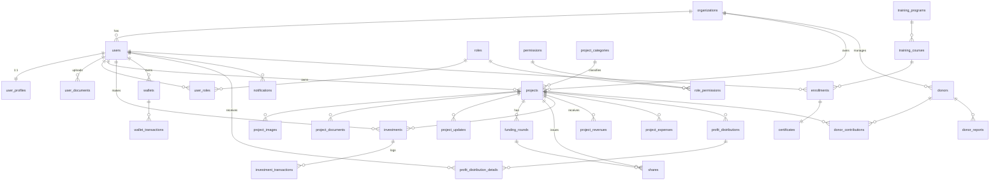

# 🗄️ تصميم قاعدة بيانات PostgreSQL — منصة الاستثمار المجتمعي

> تصميم **Production-Ready** متعدد المستأجرين (Multi-Tenant SaaS)، بمعايير المنصات المالية والاستثمارية، قابل للتوسّع لآلاف المستخدمين والمشاريع وللتحوّل لاحقاً إلى منصة استثمار حقيقية.

**ملفات السكربت (تُنفَّذ بالترتيب):**
| # | الملف | الوصف |
|---|---|---|
| 1 | `db/01_schema.sql` | الجداول، الأنواع (ENUM)، المفاتيح، القيود |
| 2 | `db/02_indexes.sql` | الفهارس لتحسين الأداء |
| 3 | `db/03_business_rules.sql` | المحفزات (Triggers) لقواعد العمل + التدقيق |
| 4 | `db/04_security_rls.sql` | عزل المستأجرين عبر Row-Level Security |
| 5 | `db/05_seed.sql` | بيانات مرجعية (أدوار، صلاحيات) |

---

## أولاً: تحليل الكيانات الرئيسية

### إدارة المستخدمين والصلاحيات (RBAC)
| الكيان | الوظيفة | العلاقات | سبب الوجود |
|---|---|---|---|
| `organizations` | جذر المستأجر (Tenant) | أب لكل الكيانات | دعم SaaS متعدد المؤسسات |
| `users` | حسابات المستخدمين | ينتمي لمؤسسة، له أدوار/محفظة/استثمارات | الهوية والمصادقة |
| `roles` | الأدوار (مستثمر/صاحب مشروع/مدير/مالي/مراقب) | M:N مع `permissions` و `users` | تنظيم الصلاحيات |
| `permissions` | صلاحيات تفصيلية | M:N مع `roles` | تحكم دقيق RBAC |
| `role_permissions` | جدول ربط | يربط `roles`↔`permissions` | تطبيق M:N |
| `user_roles` | جدول ربط | يربط `users`↔`roles` | مستخدم بأدوار متعددة |
| `user_profiles` | بيانات شخصية موسّعة | 1:1 مع `users` | فصل بيانات PII |
| `user_documents` | مرفقات تحقق الهوية (KYC) | 1:N من `users` | الامتثال والتحقق |

### إدارة المشاريع
| الكيان | الوظيفة | العلاقات |
|---|---|---|
| `project_categories` | تصنيفات (زراعي/حيواني/صناعي/حرفي/منزلي/خدمات) | 1:N مع `projects`، شجري عبر `parent_id` |
| `projects` | بيانات المشروع المالية والوصفية | يملكه `user`، له صور/مرفقات/تحديثات/جولات/استثمارات |
| `project_images` | صور المشروع | 1:N من `projects` |
| `project_documents` | مرفقات المشروع | 1:N من `projects` |
| `project_updates` | تحديثات دورية | 1:N من `projects` |

### إدارة الاستثمار
| الكيان | الوظيفة | العلاقات |
|---|---|---|
| `funding_rounds` | جولات التمويل لكل مشروع | 1:N من `projects` |
| `shares` | دفتر الأسهم (الإجمالي/المُصدَر) | مرتبط بالمشروع والجولة |
| `investments` | عمليات الاستثمار | يربط `users`↔`projects` (M:N محقَّق) |
| `investment_transactions` | سجل عمليات كل استثمار (غير قابل للتعديل) | 1:N من `investments` |
| `investment_history` | لقطة مجمّعة لكل مستثمر/مشروع | تجميع للقراءة السريعة |

### الإدارة المالية
| الكيان | الوظيفة |
|---|---|
| `wallets` | محفظة المستخدم (رصيد + رصيد محجوز) — 1:1 لكل عملة |
| `wallet_transactions` | حركات المحفظة (دفتر أستاذ بالرصيد بعد كل حركة) |
| `project_revenues` / `project_expenses` | إيرادات/مصاريف المشروع |
| `profit_distributions` | عمليات توزيع الأرباح على مستوى المشروع |
| `profit_distribution_details` | حصة كل مستثمر في التوزيع |
| `financial_reports` | تقارير مالية مجمّعة (JSONB) |

### الإشعارات
`notifications`, `notification_logs`, `email_logs`, `sms_logs` — قنوات متعددة (in_app/email/sms/push) مع سجلات تسليم.

### لوحة الإدارة والتدقيق
`system_settings` (إعدادات لكل مستأجر), `activity_logs` (نشاط المستخدمين), `audit_logs` (تدقيق تلقائي before/after عبر Triggers), `admin_actions` (إجراءات الإدارة).

### تدريب رواد الأعمال
`training_programs` → `training_courses` → `enrollments` → `certificates`.

### الجهات المانحة
`donors`, `donor_contributions` (مساهمات لكل مشروع), `donor_reports`.

---

## ثانياً: مخطط ERD (العلاقات)



### شرح أنواع العلاقات
- **One-to-One (1:1):** `users`↔`user_profiles` (فصل PII)، `enrollments`↔`certificates`.
- **One-to-Many (1:N):** `organizations`→`users`/`projects`، `projects`→`investments`/`funding_rounds`/`images`، `wallets`→`wallet_transactions`.
- **Many-to-Many (M:N):**
  - `users`↔`roles` عبر `user_roles`.
  - `roles`↔`permissions` عبر `role_permissions`.
  - `users`↔`projects` عبر `investments` (مع حمولة: الأسهم والمبلغ).

---

## الحادي عشر: Data Dictionary (مختصر)

> القاموس الكامل لكل حقل (النوع، PK/FK، القيود) موثّق inline داخل `db/01_schema.sql`. أمثلة رئيسية:

### `users`
| الحقل | النوع | قيود |
|---|---|---|
| id | BIGINT IDENTITY | PK |
| uuid | UUID | UNIQUE, default gen_random_uuid() |
| organization_id | BIGINT | FK→organizations, NOT NULL |
| email | CITEXT | UNIQUE(organization_id,email) |
| password_hash | TEXT | NOT NULL (bcrypt/argon2) |
| account_status | ENUM | pending/active/suspended/closed |

### `projects`
| الحقل | النوع | قيود |
|---|---|---|
| id | BIGINT IDENTITY | PK |
| owner_id | BIGINT | FK→users |
| total_shares | NUMERIC(20,4) | CHECK > 0 |
| share_price | NUMERIC(18,2) | CHECK > 0 |
| funded_amount | NUMERIC(18,2) | CHECK ≥ 0 |
| status | ENUM | draft…published…completed |

### `investments`
| الحقل | النوع | قيود |
|---|---|---|
| investor_id | BIGINT | FK→users |
| project_id | BIGINT | FK→projects |
| shares | NUMERIC(20,4) | CHECK > 0 |
| amount | NUMERIC(18,2) | CHECK > 0 |
| status | ENUM | pending/confirmed/cancelled/refunded |

**مبادئ النمذجة المالية:** كل المبالغ `NUMERIC(18,2)` (لا `FLOAT` أبداً)، الأسهم `NUMERIC(20,4)`، التواريخ `TIMESTAMPTZ` بـ UTC، والحذف الناعم عبر `deleted_at`.

---

## الثالث عشر: قواعد العمل (مطبَّقة عبر Triggers)
1. **لا نشر قبل الموافقة** — `enforce_publish_after_approval` يرفض `status='published'` بدون `approved_at`.
2. **لا شراء أسهم أكثر من المتاح** — `enforce_share_availability` يقفل صف `shares` (FOR UPDATE) ويتحقق ويحدّث `issued_shares` و`funded_amount` ذرّياً.
3. **لا توزيع أرباح يتجاوز المسجّل** — `enforce_distribution_cap` يقارن مجموع التفاصيل مع `distributable`.
4. **لا حذف مشروع له استثمارات** — `block_project_delete_with_investments` (يُستخدم الحذف الناعم بدلاً منه).
5. **لا تعطيل مستخدم بعمليات مالية معلّقة** — `block_user_disable_with_pending_finance`.

---

## الرابع عشر: الأمان
- **RBAC:** `roles`/`permissions`/`role_permissions`/`user_roles` — صلاحيات دقيقة على مستوى الوحدة والعملية.
- **عزل المستأجرين (RLS):** سياسة `tenant_isolation` على الجداول الحساسة عبر `current_org_id()` من `app.current_org_id` (يُضبط لكل طلب). `FORCE ROW LEVEL SECURITY` يمنع التجاوز.
- **تشفير البيانات الحساسة:** كلمات المرور كـ hash (bcrypt/argon2) فقط؛ تشفير على مستوى التخزين (TDE/pgcrypto للحقول فائقة الحساسية)؛ TLS أثناء النقل.
- **سجل تدقيق:** `audit_logs` يُملأ تلقائياً (old/new JSONB) لجداول المال والمشاريع، مع `actor_id` من `app.current_user_id`.
- **مراقبة الأنشطة المشبوهة:** `activity_logs` (IP/User-Agent) + تنبيهات على أنماط شاذة (محاولات دخول، سحوبات متكررة).
- **النسخ الاحتياطي:** `pg_basebackup` يومي + WAL archiving (PITR)، اختبار استعادة دوري، تخزين خارج الموقع مشفّر.

---

## الخامس عشر: الأداء والتوسّع
- **الفهارس:** مركّبة على المسارات الساخنة (`projects(organization_id,status)`، `investments(investor_id,invested_at)`)، جزئية (`WHERE is_read=FALSE`)، و GIN/trgm للبحث النصي.
- **تحسين الاستعلامات:** استخدام `EXPLAIN (ANALYZE, BUFFERS)`، تجنّب N+1، Materialized Views للتقارير الثقيلة (`financial_reports`).
- **Partitioning:** تقسيم زمني (RANGE على `created_at`) لـ `audit_logs`/`activity_logs`/`wallet_transactions`/`investment_transactions`؛ ويمكن التقسيم بـ `organization_id` (LIST/HASH) للمستأجرين الكبار.
- **Caching:** طبقة Redis للجلسات والاستعلامات شبه الثابتة (قوائم المشاريع، الإحصائيات)، مع إبطال عند الكتابة.
- **Read Replicas:** فصل القراءة (لوحات/تقارير) عن الكتابة (المعاملات المالية) عبر نسخ قراءة، مع توجيه الاستعلامات.
- **سلامة المعاملات:** عمليات المال داخل `BEGIN…COMMIT` مع أقفال صفّية (FOR UPDATE) ومستوى عزل مناسب لمنع Race Conditions.

---

## السادس عشر: استراتيجية Multi-Tenant (SaaS)
- **النموذج:** Shared Database / Shared Schema مع `organization_id` (tenant_id) على كل جدول أعمال + **RLS** للعزل التلقائي — أفضل توازن بين التكلفة والعزل لآلاف المستأجرين.
- **العضوية:** `organization_users` تتيح انتماء مستخدم لعدة مؤسسات؛ `is_owner` لمالك المستأجر.
- **التخصيص لكل مستأجر:** `system_settings(organization_id,key,value JSONB)` و`organizations.settings`.
- **التوسّع لعدة جهات مانحة وبرامج استثمارية:** `donors` و`training_programs` و`funding_rounds` كلها مرتبطة بالمستأجر، ما يسمح بتعدد البرامج ضمن نفس المؤسسة أو عبر مؤسسات.
- **مسار الترقية مستقبلاً:** الانتقال للمستأجرين فائقي الحجم إلى Schema-per-tenant أو Database-per-tenant دون تغيير نموذج البيانات (نفس الجداول).

---

## السابع عشر: المخرجات
1. ✅ مخطط ERD (Mermaid أعلاه — يُعرض مباشرة على GitHub).
2. ✅ تصميم قاعدة البيانات كاملاً (`db/01_schema.sql`).
3. ✅ كل الجداول والعلاقات (FK/Constraints).
4. ✅ سكربت PostgreSQL جاهز للتنفيذ (5 ملفات مرتّبة).
5. ✅ Data Dictionary (هذا المستند + تعليقات inline).
6. ✅ توثيق قاعدة البيانات (هذا المستند).
7. ✅ خطة التوسّع المستقبلية (أقسام 15–16).
8. ✅ أفضل ممارسات SaaS/FinTech/التمويل الجماعي.

### تشغيل السكربت
```bash
createdb cmip
psql -d cmip -f db/01_schema.sql
psql -d cmip -f db/02_indexes.sql
psql -d cmip -f db/03_business_rules.sql
psql -d cmip -f db/04_security_rls.sql
psql -d cmip -f db/05_seed.sql
```
